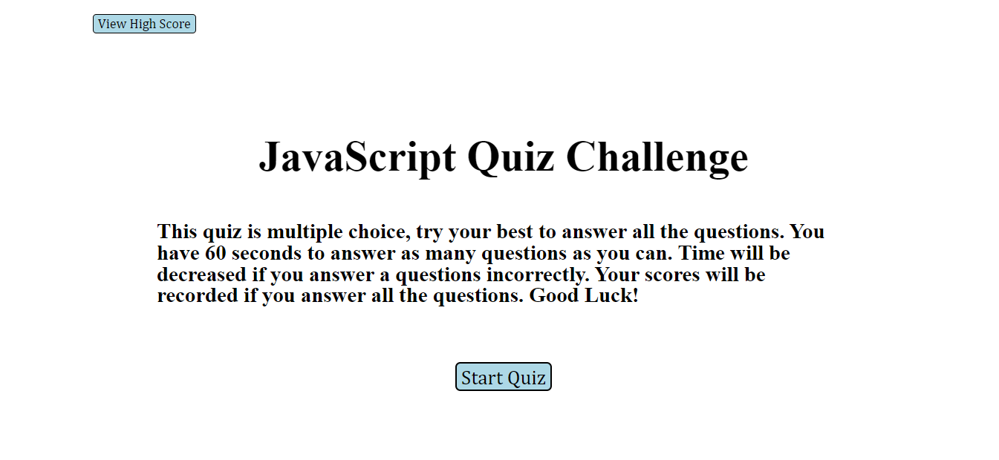

# TimedCodeQuiz

## Description

This project consisted of "HUGE AMOUNTS" of Javascript. The challenge is made of 10 Javascript questions. The core concepts used in this project are querySelectors, Object/Arrays, call back functions, conditional statements, timers, global variables, boolean variables, functions, event handlers, dom traversal, creating dom elements in javascript, appending elements in javascript, and styling elements directly from javascript!    

## Installation

Access to repository here:
[Repository url](https://github.com/myang5t3r/TimedCodeQuiz)

Live Deployment here:
[https://myang5t3r.github.io/TimedCodeQuiz/](https://myang5t3r.github.io/TimedCodeQuiz/)

## Usage
The usages of this project is for informational and learning purposes only.  
Everyone is welcome to test there knowledge of Javascript.
 
 

